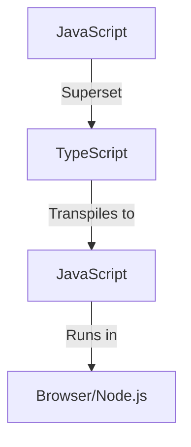

# TypeScript


## 📜 Introduction

**TypeScript** is a strongly typed superset of JavaScript that compiles to plain JavaScript. It provides static type checking, allowing developers to write more robust and scalable code for complex applications.

In this project, we explore how TypeScript enhances JavaScript by enforcing type declarations and improving error-checking during development.

### 🛠️ Key Features

- **Static Typing**: TypeScript enforces types at compile time, reducing runtime errors.
- **Modern JavaScript Features**: TypeScript supports the latest ECMAScript features while ensuring compatibility with older browsers.
- **Tooling Support**: Works well with editors like Visual Studio Code with autocompletion, refactoring, and linting.

## 🚀 Getting Started

To run this TypeScript project locally, follow the steps below:

1. **Clone the repository**:
   ```bash
   git clone https://github.com/your-repo-name/typescript-project.git
   cd typescript-project
   ```

2. **Install dependencies**:
   ```bash
   npm install
   ```

3. **Compile TypeScript**:
   ```bash
   tsc
   ```

4. **Run the project**:
   ```bash
   node dist/index.js
   ```

## 📝 TypeScript Basics

Here are a few TypeScript examples to demonstrate its static typing capabilities.

### Example 1: Static Type Checking

```typescript
let greeting: string = "Hi Rajeev";
let num: number = 5;

console.log(greeting.toLowerCase()); // Hi rajeev
```

In the example above, TypeScript checks that `greeting` is of type `string` and `num` is a number. It flags an error if the wrong type is assigned.

### Example 2: Using `Any` Type

```typescript
let hero: any;

function getHero() {
    return "Thor";
}

hero = getHero();  // TypeScript allows dynamic typing with 'any'
```

The `any` type allows flexibility when you don't know the exact type in advance, but it's generally avoided in large projects to maintain type safety.

## 📊 Diagram: TypeScript vs JavaScript



### 🧩 Data Types Supported

- **Primitive Types**: `Number`, `String`, `Boolean`, `Null`, `Undefined`, `Void`
- **Complex Types**: `Array`, `Object`, `Tuple`, `Any`


